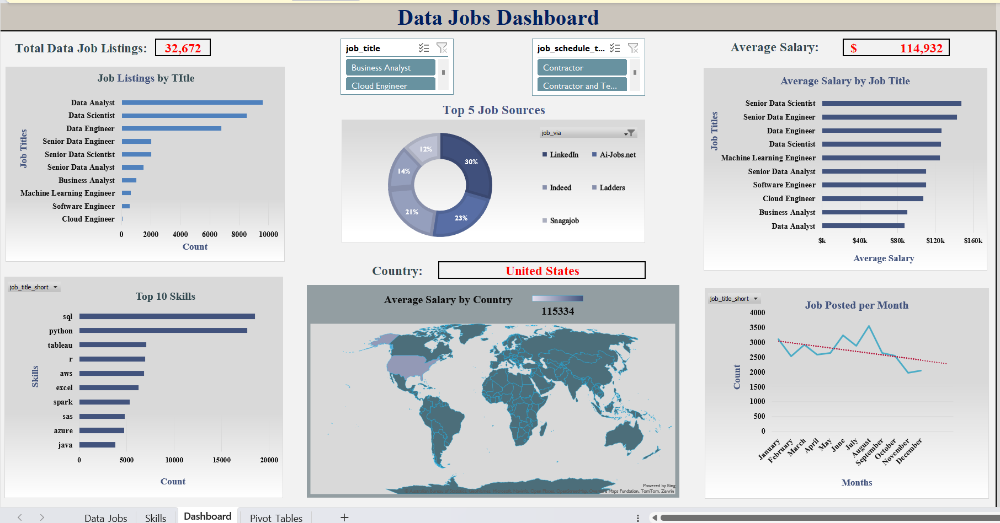

# 📊 Excel Data Jobs Dashboard

An interactive Excel dashboard that analyzes job listings in the data industry — focusing on job roles, average salaries, required skills, job sources, and monthly trends across countries.

---

## 🔍 Project Overview

This project explores:
- Top job titles by number of listings
- Average salary by job title and country
- Top 10 most in-demand skills
- Job posting trends by month
- Top 5 job platforms
- Country-based filtering (e.g., United States)

All insights are presented in a dynamic, slicer-controlled dashboard.

---

## 💡 Key Features

- 📁 Excel-based interactive dashboard
- 📌 KPIs for Total Listings, Average Salary, and Country
- 🎯 Pivot Tables, Power Pivot, and Slicers for filtering
- 📥 Data cleaning and transformation using Power Query
- 📈 Visuals: bar chart, donut chart, line chart, filled map
- 🎨 Professionally designed with clean and consistent color themes

---

## 📌 Key Insights

- 📌 **Data Analyst** is the most advertised job title across platforms.
- 💰 **Average salary** is highest for **Data Engineers**, especially in full-time roles.
- 🧠 **Python**, **SQL**, and **communication skills** are the top 3 required skills.
- 🌍 Most job listings are concentrated in **United States** and **Australia**.
- 📅 Job postings peak during **mid-year months** (June to August).
- 🔗 **LinkedIn** and **Indeed** are the top job posting platforms.

---

## 🖼️ Dashboard Preview

---

## 🛠️ Tools Used

- **Microsoft Excel**
  - PivotTables & Slicers
  - **Power Pivot** (Data Model & relationships)
  - **Power Query** (Data cleaning & transformation)
  - Charts: Bar, Donut, Line, Map

---

## 🎯 Use Case

This dashboard is ideal for:
- Job seekers analyzing demand
- HR teams tracking market trends
- Students and professionals showcasing Excel data skills
- Portfolio and interview preparation

---

## 🧑‍💻 Author

**Visal Adithya**  
📍 Sri Lanka  
🔗 [LinkedIn](#)

---
