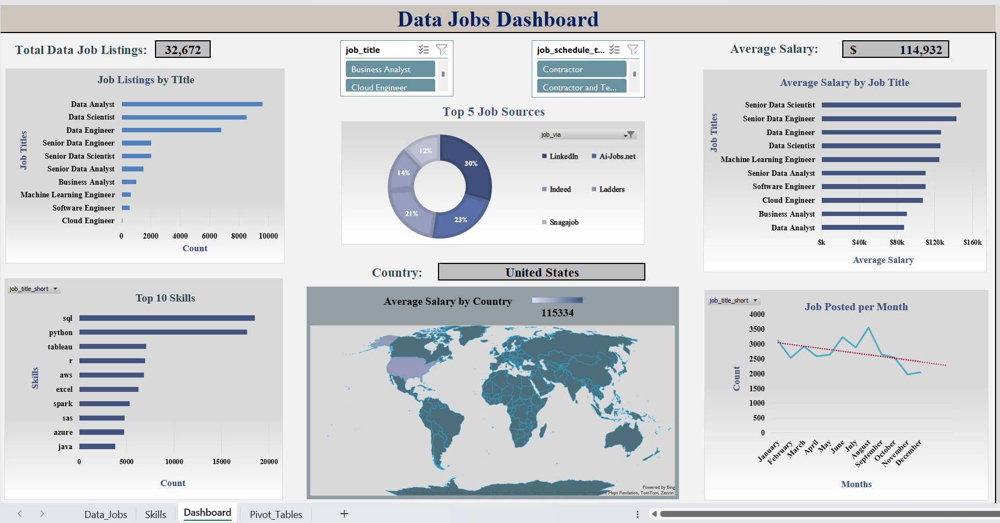

# 📊 Excel Data Jobs Dashboard

This Excel dashboard project analyzes 2023 job market data focused on data-related roles. It uses Power Query for cleaning and transforming raw data, and Power Pivot to model relationships and build efficient calculations. Interactive visuals include job listings by title, average salary by role and country, skill demand, and posting trends across months and platforms.

---

## 🔍 Project Overview

This project explores:
- Top job titles by number of listings
- Average salary by job title and country
- Top 10 most in-demand skills
- Job posting trends by month
- Top 5 job platforms
- Country-based filtering (e.g., United States)

All insights are presented in a dynamic, slicer-controlled dashboard.

---

## 💡 Key Features

- 📁 Excel-based interactive dashboard
- 📌 KPIs for Total Listings, Average Salary, and Country
- 🎯 Pivot Tables, Power Pivot, and Slicers for filtering
- 📥 Data cleaning and transformation using Power Query
- 📈 Visuals: bar chart, donut chart, line chart, filled map
- 🎨 Professionally designed with clean and consistent color themes

---

## 📌 Key Insights

- 📌 **Data Analyst** is the most advertised job title across platforms.
- 💰 **Average salary** is highest for **Data Engineers**, especially in full-time roles.
- 🧠 **Python**, **SQL**, and **communication skills** are the top 3 required skills.
- 🌍 Most job listings are concentrated in **United States** and **Australia**.
- 📅 Job postings peak during **mid-year months** (June to August).
- 🔗 **LinkedIn** and **Indeed** are the top job posting platforms.

---

## 🛠️ Tools Used

- **Microsoft Excel**
  - PivotTables & Slicers
  - **Power Pivot** (Data Model & relationships)
  - **Power Query** (Data cleaning & transformation)
  - Charts: Bar, Donut, Line, Map

---

## 🖼️ Dashboard Preview

---
